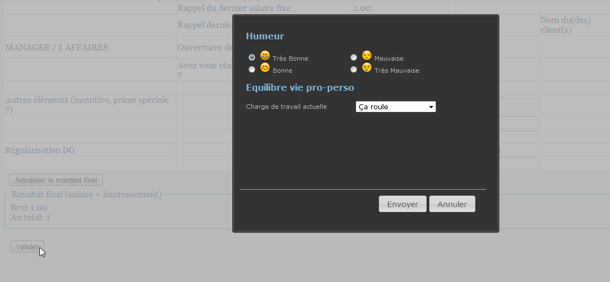

#Satisfaction-tool !

##Description du projet :

Satisfaction tool permet de collecter chaque mois humeur, appréciation de l'équilibre vie pro / vie perso et principaux irritants des salariés. 
il automatise la génération de reportings à destination des managers et directeurs et la consolidation annuelle des éléments remontés.

##Dépendances :

    + Php5 / mysql
    + Composer

##Démontration:

##Intégration :

Vous souhaitez que l'on intègre cette application avec vous, 
alors n'hésitez pas à contacter par mail l'équipe IT / Web de Davidson à l'adresse suivante : davidson@davidson.fr
